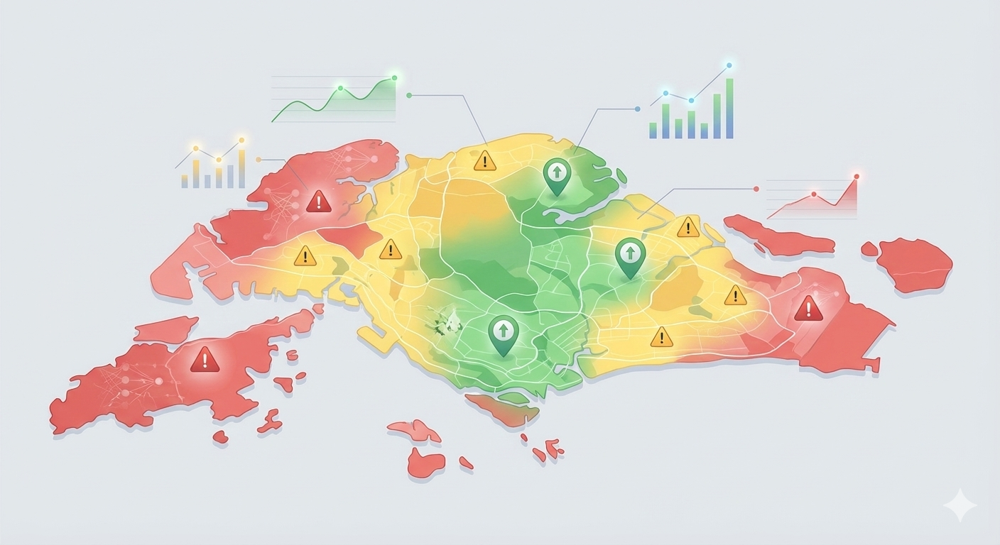
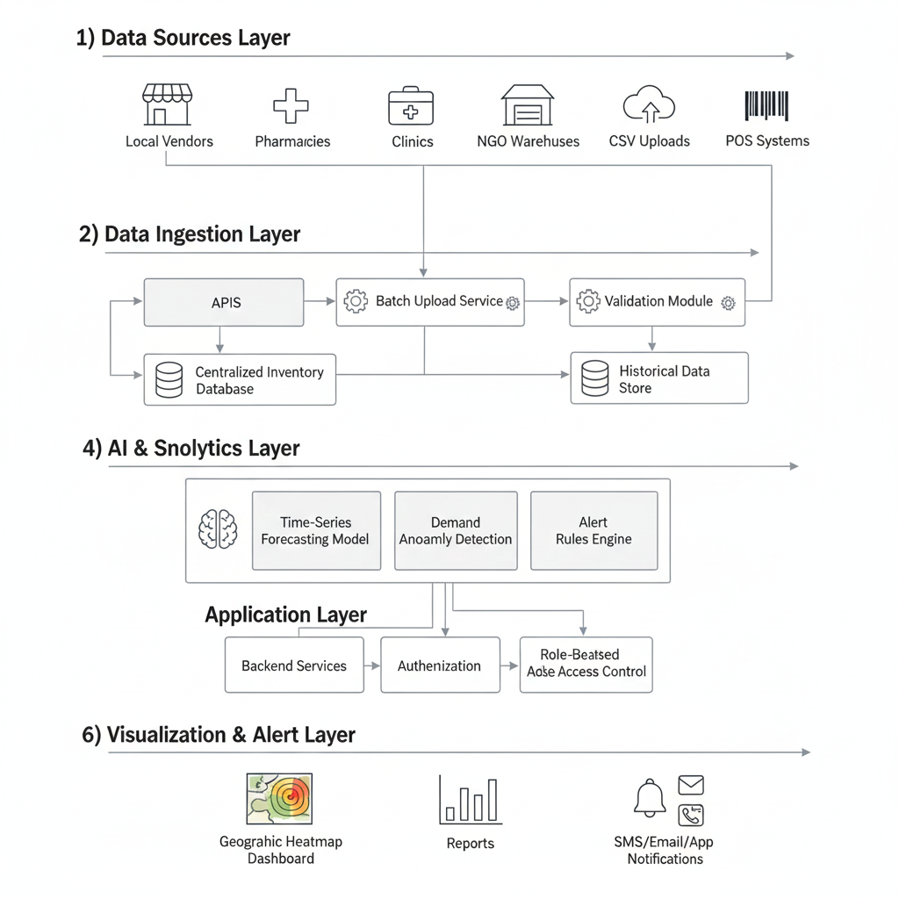
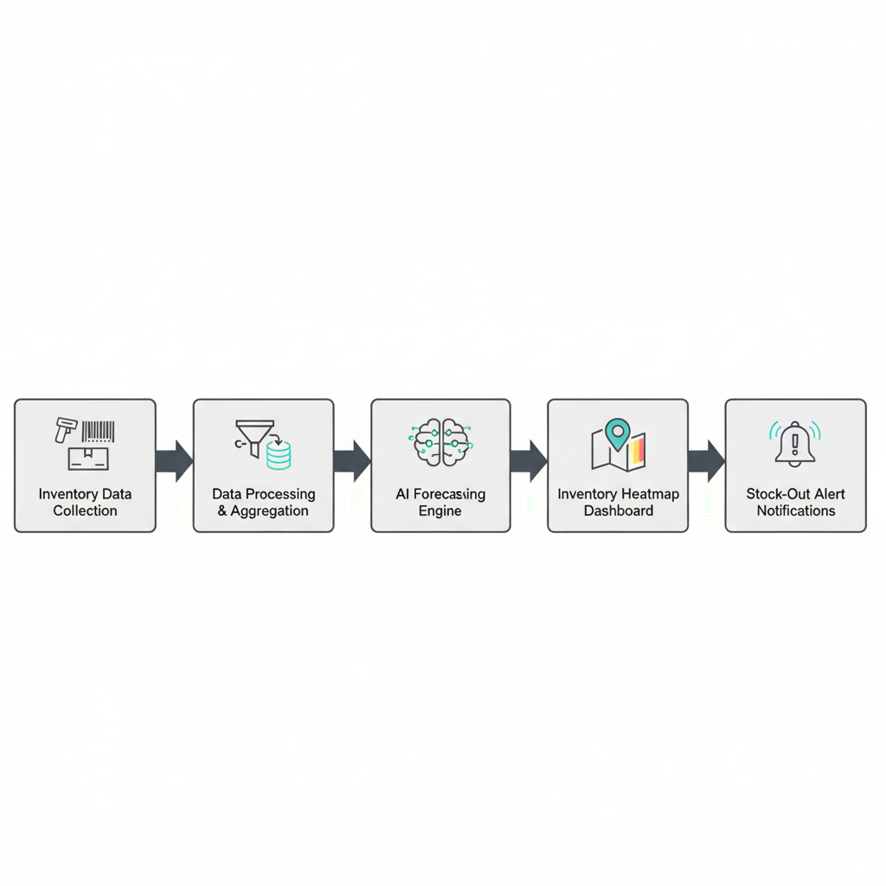

# Inventory-Heatmap-Stock-Alerts

# Inventory Heatmap & Stock-Out Alerts

**AI-Powered Platform for Predicting and Preventing Stock-Outs of Essential Goods**

---

## Project Overview
This project monitors inventory levels of essential goods across multiple locations, visualizes them using heatmaps, predicts stock depletion using AI, and triggers alerts for stakeholders.  

**Key Features:**
- Real-time inventory aggregation
- Geographic heatmap visualization
- AI-based stock depletion forecasting
- Stock-out alert system (SMS, Email, Dashboard)
- Historical trends and reporting

---

## Folder Structure

```
Inventory-Heatmap-Stock-Alerts/
├─ frontend/ │
  ├─ index.html │
 ├─ style.css │
 └─ script.js
 ├─ backend/ │
  ├─ app.py │
 └─ requirements.txt
 ├─ data/ │
 └─ inventory_sample.csv
 ├─ diagrams/ │
 ├─ architecture.jpg │
  ├─ process_flow.jpg │
  └─ heatmap.jpg
 ├─ README.md
 └─ LICENSE

```
---

## Tech Stack
- **Frontend:** HTML, CSS, JS, Chart.js  
- **Backend:** FastAPI (Python)  
- **Database:** CSV (mock)  
- **AI/ML:** Time-series forecasting (mocked)  
- **Alerts:** Placeholder SMS/Email  
- **Deployment:** Render / Railway / Replit  

---

## Screenshots

### Dashboard


### Architecture


### Process Flow


---

## Deployment Steps (Fastest Method)

1. **Push the Repo to GitHub**:
2. git init git add .
3. git commit -m "Initial commit"
4. git branch -M main
5. git remote add origin
6. git push -u origin main

2. **Deploy Backend** (Render / Railway / Replit):
- Create a new Python app
- Connect GitHub repo
- Set start command:  
  ```
  uvicorn backend.app:app --host 0.0.0.0 --port $PORT
  ```
- Add requirements.txt → auto-install
- Deploy

3. **Deploy Frontend**:
- Can use **GitHub Pages** or **Replit static site**
- Ensure `index.html` references diagrams using relative paths

4. **Access API Endpoints**:
- `/inventory` → returns JSON inventory data
- `/alerts` → returns low-stock alerts
- `/forecast` → returns stock depletion forecast

